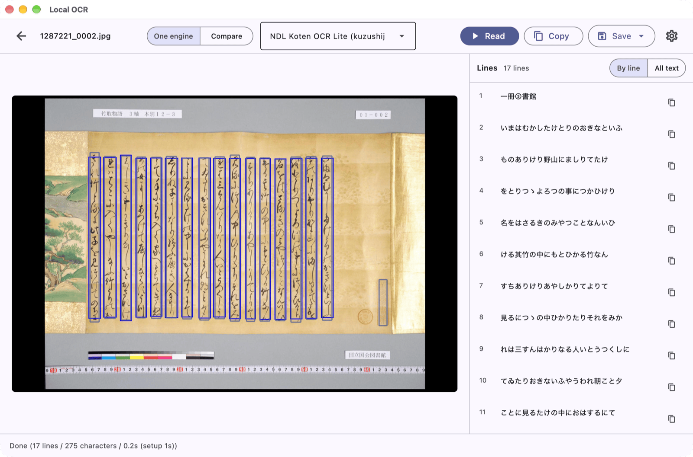

Images in, characters out — nothing else.
Recognition happens entirely on your computer; your images never leave it.

It reads Japanese (from modern print to pre-modern cursive, kuzushiji),
Chinese (classical and modern), English and Tibetan.
Choose the recognition engine to match the material.

### Download

| | |
| --- | --- |
| Windows | [Microsoft Store](https://apps.microsoft.com/detail/9N07ZD1ZPKBZ) (free; the Store signs it, so no SmartScreen warning) |
| macOS | [Releases](https://github.com/nakamura196/local-ocr/releases/latest) (signed and notarised `.dmg`) |

Nothing else to install. `llama-server`, which runs the PaddleOCR-VL model,
is bundled with the application; recognition models are fetched on first use.

### Watch

Four short videos play in a row: installing, basic use, more ways to use it, and using it from the TEI/IIIF editor.
The narration and captions are in Japanese.

<iframe src="https://www.youtube-nocookie.com/embed/DUlKilClRgM?playlist=DUlKilClRgM,qaLAR2l7FPI,SSWMVJbkjf8,O56_yGbKBVI&rel=0" title="How to use Local OCR" style="width:100%;aspect-ratio:16/10;border:0" allow="encrypted-media; picture-in-picture; fullscreen" allowfullscreen loading="lazy"></iframe>

### What it does

- **Input**: image files, the clipboard, a folder of page images, or a [IIIF](https://iiif.io/) manifest URL
- **Output**: plain text (`.txt`) or TEI/XML (`.xml`)
- **Compare**: run two engines over the same page and read the results side by side
- Japanese and English interface, light and dark

### Links

- [How to use](guide.md) (in Japanese)
- [Source code](https://github.com/nakamura196/local-ocr) (MIT)
- [Privacy policy](privacy-policy.md)

### Credits

Satoru Nakamura (The University of Tokyo).
Contact: nakamura@hi.u-tokyo.ac.jp
