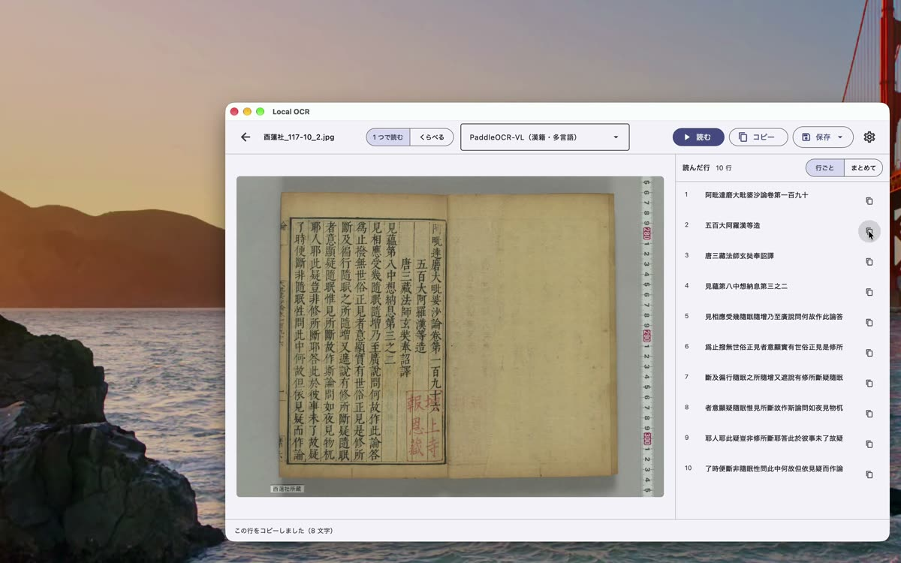
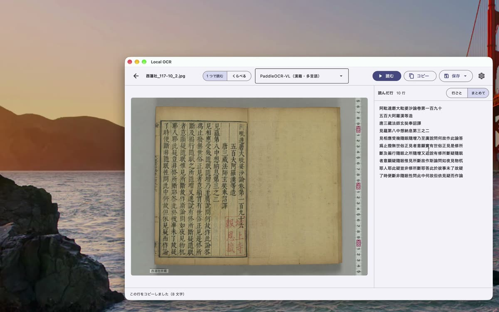
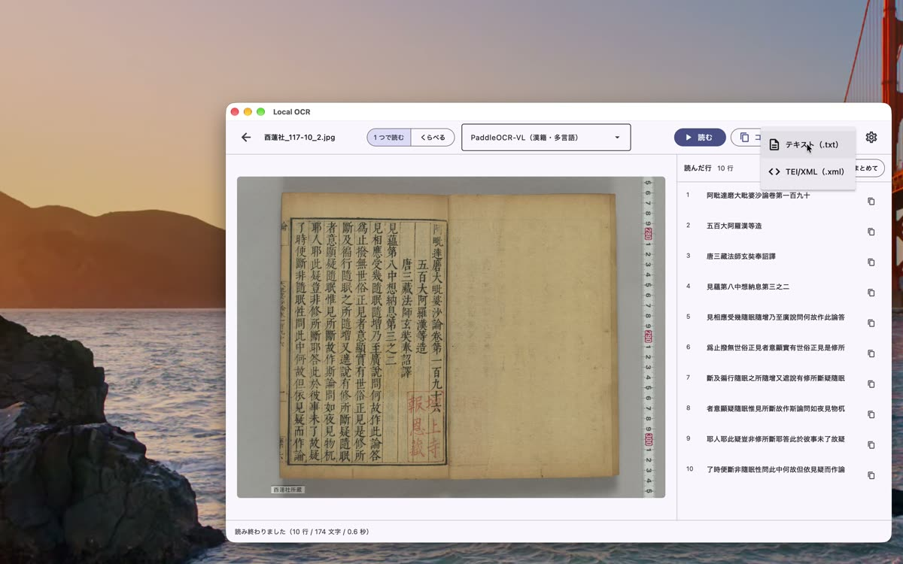
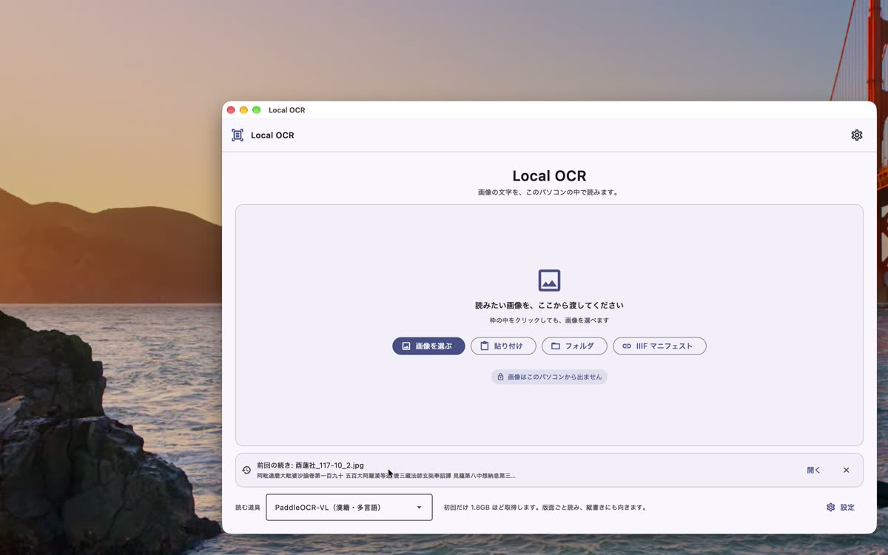

<iframe src="https://www.youtube-nocookie.com/embed/qaLAR2l7FPI" title="基本の使い方" style="position:absolute;top:0;left:0;width:100%;height:100%;border:0" allow="encrypted-media; picture-in-picture" allowfullscreen></iframe>

## 1. 画像を開いて読む

最初の画面で「画像を選ぶ」を押し、読みたい画像を開きます。開くとすぐに読み始めます。
アプリを開いて最初に読むときだけ、準備に少し時間がかかります。

左に画像、右に読み取った文字が 1 行ずつ出ます。いちばん下には、行の数・文字の数・かかった時間が出ます。

## 2. 確かめて、コピーする

1 行だけ使いたいときは、行の右にあるボタンを押します。その行がコピーされ、ほかのソフトに貼り付けられます。

右上の「まとめて」を押すと、全体を 1 つの文章として見られます。この表示では、文字を直接直せます。
上の「コピー」を押すと、全体がコピーされます。直した文字も、そのままコピーされます。

## 3. 保存する

「保存」を押すと、保存する形を選べます。

- **テキスト（.txt）**: 文字だけ
- **TEI/XML（.xml）**: 画像とのつながりも残す。翻刻の編集に使う形式です

保存する場所と名前を決めて、「保存」を押します。

## 4. 前回の続きから開く

左上の矢印で、最初の画面に戻ります。前に読んだものは「前回の続き」に残っていて、「開く」で再開できます。

次は [③ いろいろな使い方](guide-more.md) です。
