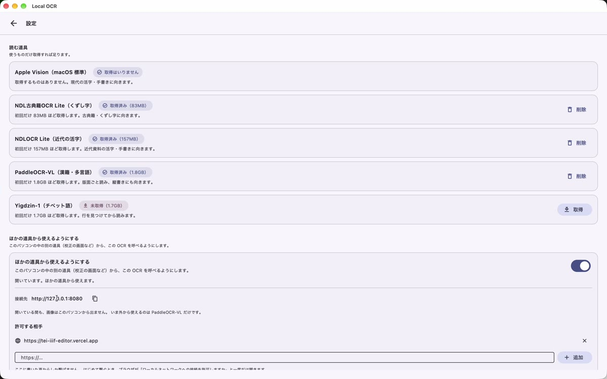
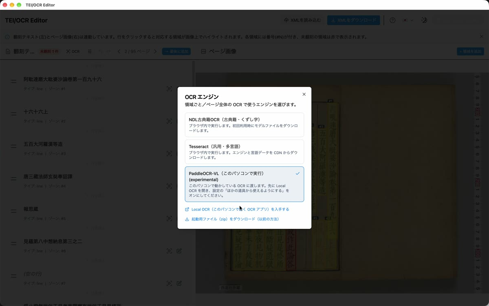
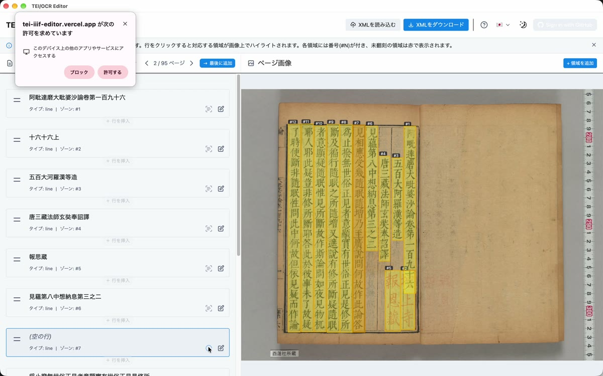
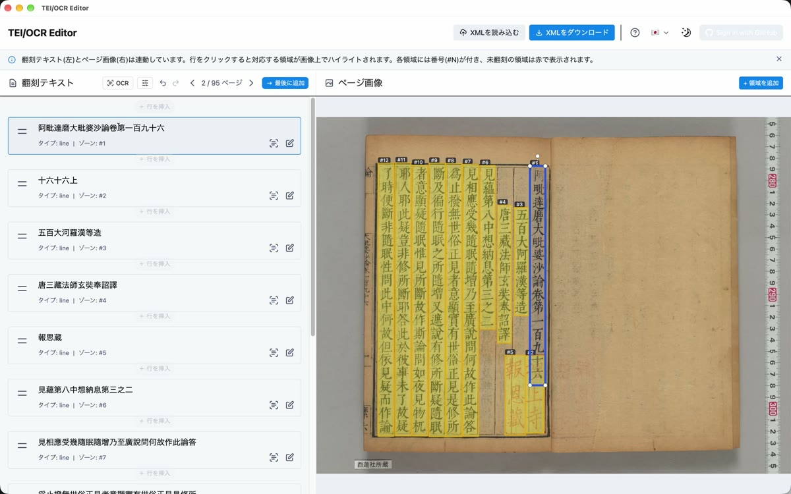
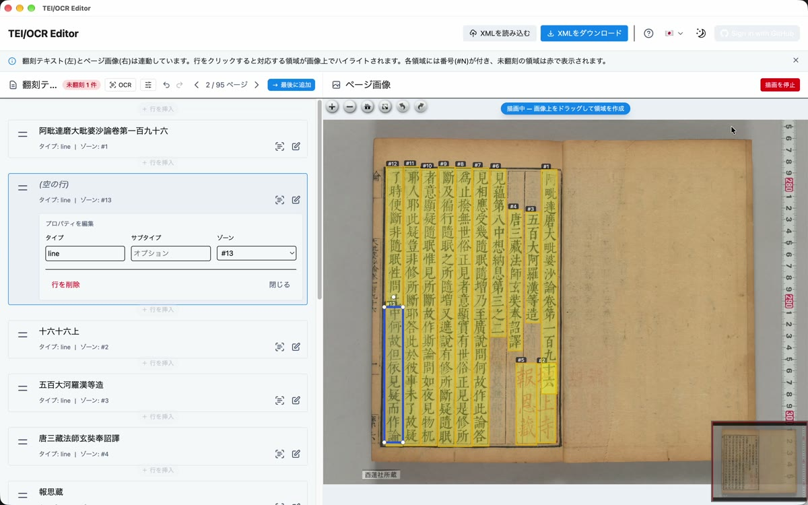
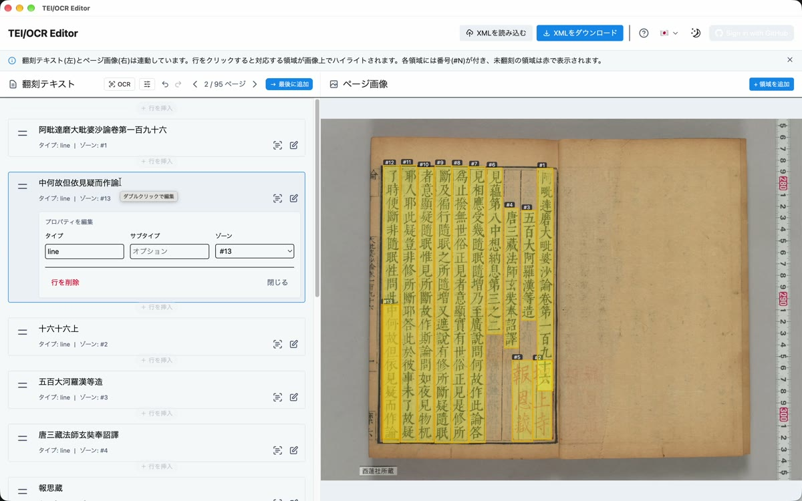

<iframe src="https://www.youtube-nocookie.com/embed/O56_yGbKBVI" title="校正の画面で使う" style="position:absolute;top:0;left:0;width:100%;height:100%;border:0" allow="encrypted-media; picture-in-picture" allowfullscreen></iframe>

[TEI/IIIF エディタ](https://tei-editor.ldas.jp)は、画像を見ながら翻刻を直すための画面です。
Local OCR を開いておくと、エディタから PaddleOCR-VL を使えます。
読むのは、エディタで選んだ枠の中だけです。1 行分でも、行の一部でもかまいません。

> 読み取りはすべて、このパソコンの中で行われます。画像は外に出ません。
{: .point }

## Local OCR で、使えるようにする

Local OCR の「設定」を開き、「ほかの道具から使えるようにする」をオンにします。
「開いています。ほかの道具から使えます。」と出れば準備完了です。初めてのときは 1 分ほどかかります。

「許可する相手」には、公開しているエディタ（`https://tei-editor.ldas.jp`）が最初から入っています。
以前の URL（`https://tei-iiif-editor.vercel.app`）も並んで入っています。前の版から使っている方にも、新しい URL が自動で足されます。
ほかの画面から使うときは、ここに足してください。

PaddleOCR-VL を取得していなければ、先に取得しておきます（[① インストールと、読む道具の取得](guide-install.md)）。

## エディタで、PaddleOCR-VL を選ぶ

エディタで TEI/XML を開き、左の欄の上にある OCR エンジンのボタンを押します。
「PaddleOCR-VL（このパソコンで実行）」を選びます。

## 枠ごとに読む

行の右にある「この領域に OCR を実行」を押すと、その行の枠の中だけを読み、行の文字が読んだ結果に置き換わります。
画像の上の赤い枠は、まだ文字が入っていない行です。

初めてのときだけ、ブラウザ（Chrome など）が「このデバイス上の他のアプリやサービスにアクセスする」の許可を求めます。
「許可する」を押してください。

## 自分で囲んだ範囲だけを読む

行の一部など、好きな範囲だけを読むこともできます。
右上の「領域を追加」を押し、画像の上で 2 か所（左上と右下）をクリックして囲みます。
囲んだ範囲が新しい行になるので、その行の「この領域に OCR を実行」を押します。

## うまくいかないとき

- 「OCR が起動していません」と出る: Local OCR が開いているか、設定のスイッチがオンかを確かめてください
- エディタの「ページ全体の OCR」（行の枠をまとめて作る機能）では、いまのところ PaddleOCR-VL は選べません。枠を作るところは、エディタの NDL古典籍OCR で行ってください
- 許可を「ブロック」してしまったとき: アドレス欄の左のアイコンを押し、「このデバイス上の他のアプリやサービスにアクセスする」を「許可する」に変えてください
