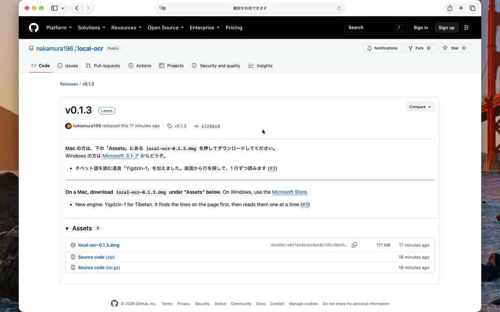
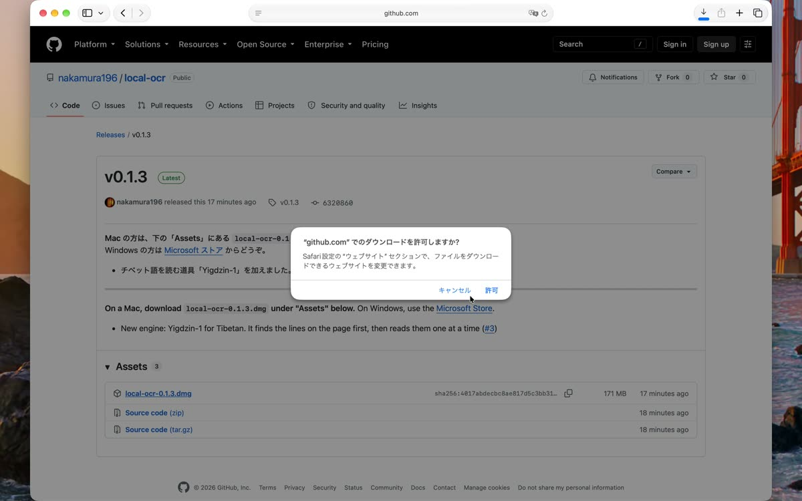
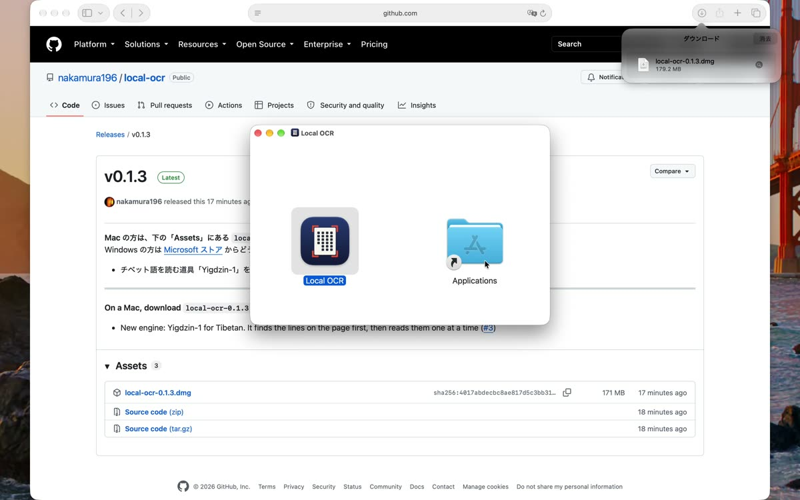
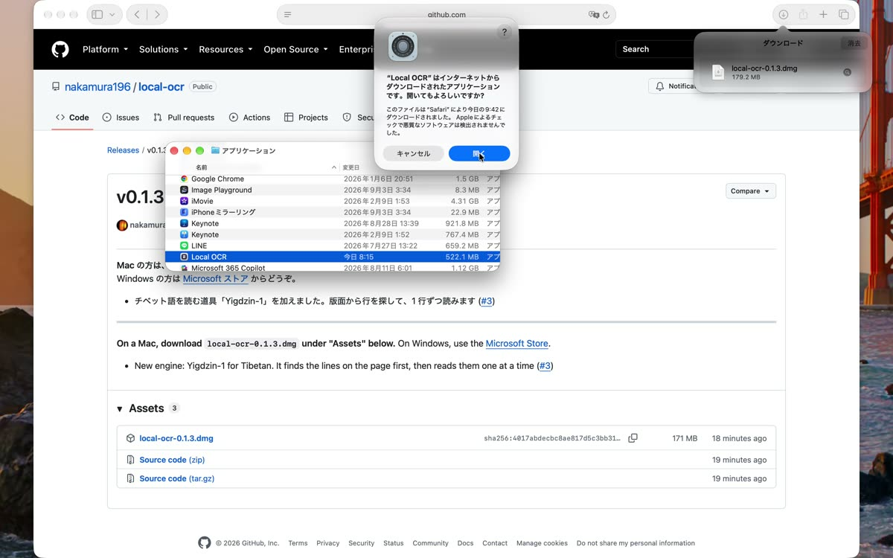
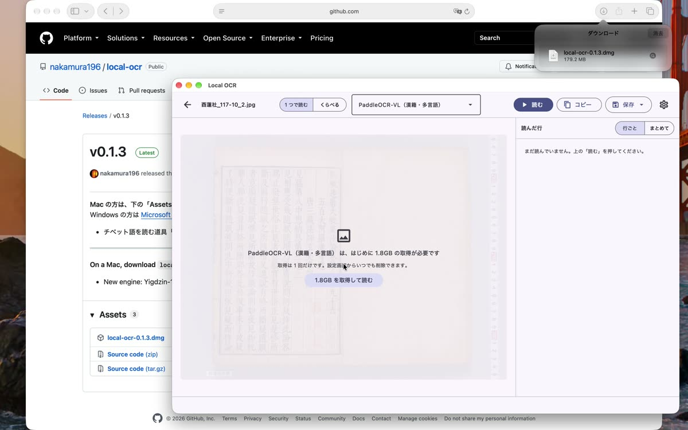
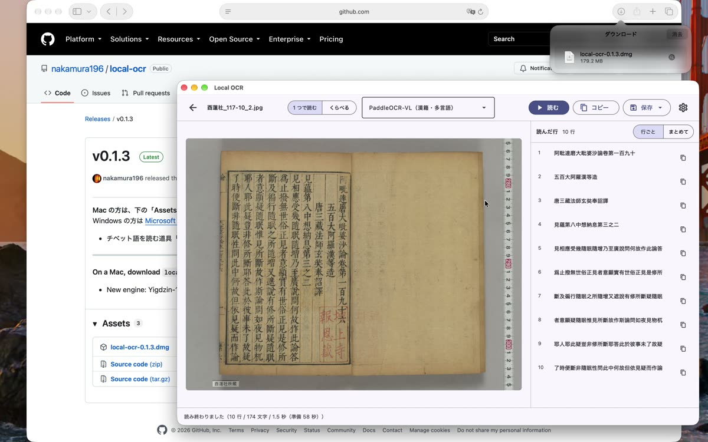

<iframe src="https://www.youtube-nocookie.com/embed/DUlKilClRgM" title="インストールと、読む道具の取得" style="position:absolute;top:0;left:0;width:100%;height:100%;border:0" allow="encrypted-media; picture-in-picture" allowfullscreen></iframe>

> Windows の方は、[Microsoft ストア](https://apps.microsoft.com/detail/9N07ZD1ZPKBZ)で「入手」を押すと入ります。以下の 1〜3 は Mac の手順です。
{: .note }

## 1. ダウンロードする

[トップページ](index.md)の「ダウンロード」で、Mac の行の「Releases」を押します。
開いたページの下の方、「Assets」にある `local-ocr-0.1.3.dmg` を押します（数字は版によって変わります）。

初めてのときは「ダウンロードを許可しますか」と聞かれます。「許可」を押します。

## 2. アプリケーションに入れる

ダウンロードが終わったら、Safari の右上の矢印のボタンを押し、一覧の `local-ocr-0.1.3.dmg` をダブルクリックします。
窓が開くので、左の「Local OCR」を右の「Applications」へドラッグします。これで入りました。窓は閉じてかまいません。

## 3. 初めて開く

Finder で「アプリケーション」フォルダを開き、Local OCR をダブルクリックします。
初めてのときだけ「インターネットからダウンロードされたアプリです。開いてもよろしいですか？」と出ます。「開く」を押します。

## 4. 読む道具を取得する

画面の下の「読む道具」で、資料に合うものを選びます。漢籍なら「PaddleOCR-VL」です。
道具によっては、初めて使うときに取得が要ります（PaddleOCR-VL は 1.8GB）。
「画像を選ぶ」で画像を開くと、取得してよいかを聞かれます。「1.8GB を取得して読む」を押します。

> 取得は最初の 1 回だけです。回線の速さによって、数分から数十分かかります。
{: .point }

終わると、そのまま読み始めます。右側に、読み取った文字が 1 行ずつ出ます。

次は [② 基本の使い方](guide-basic.md) です。
