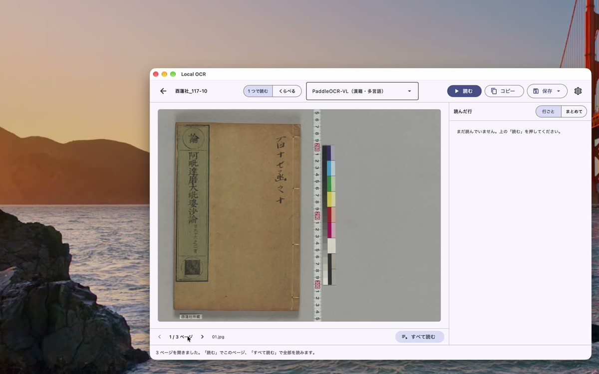
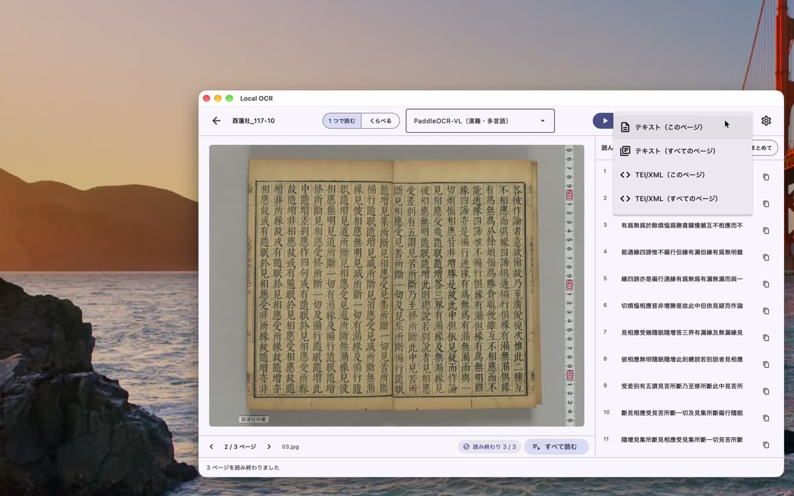
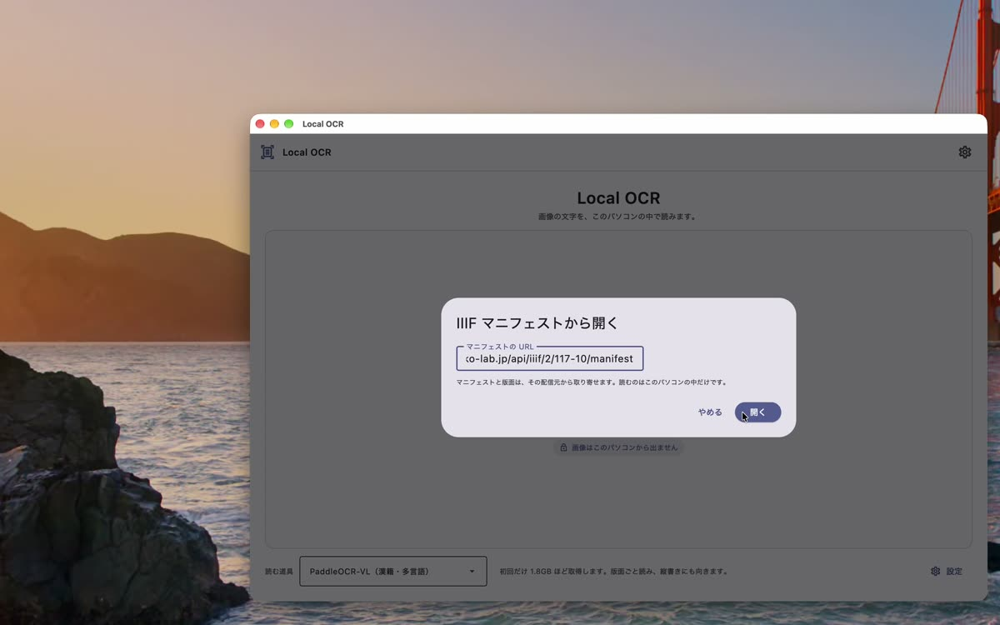
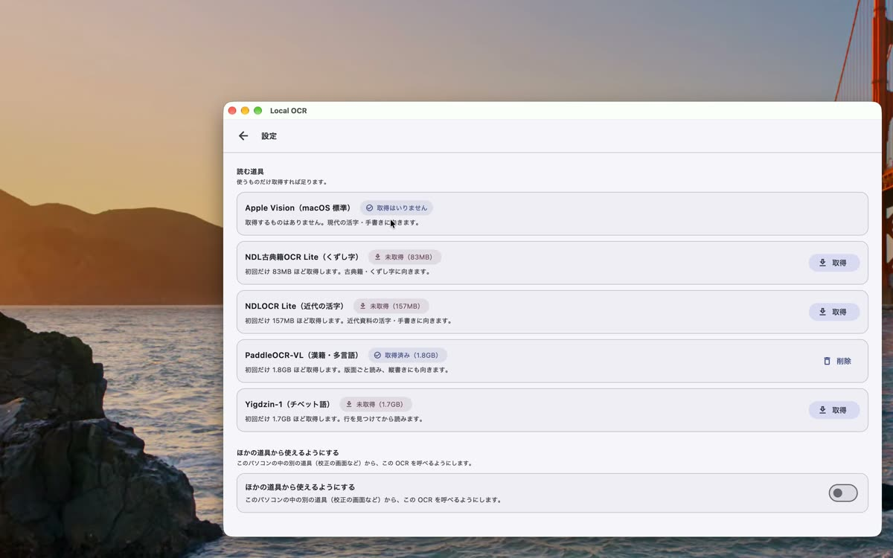
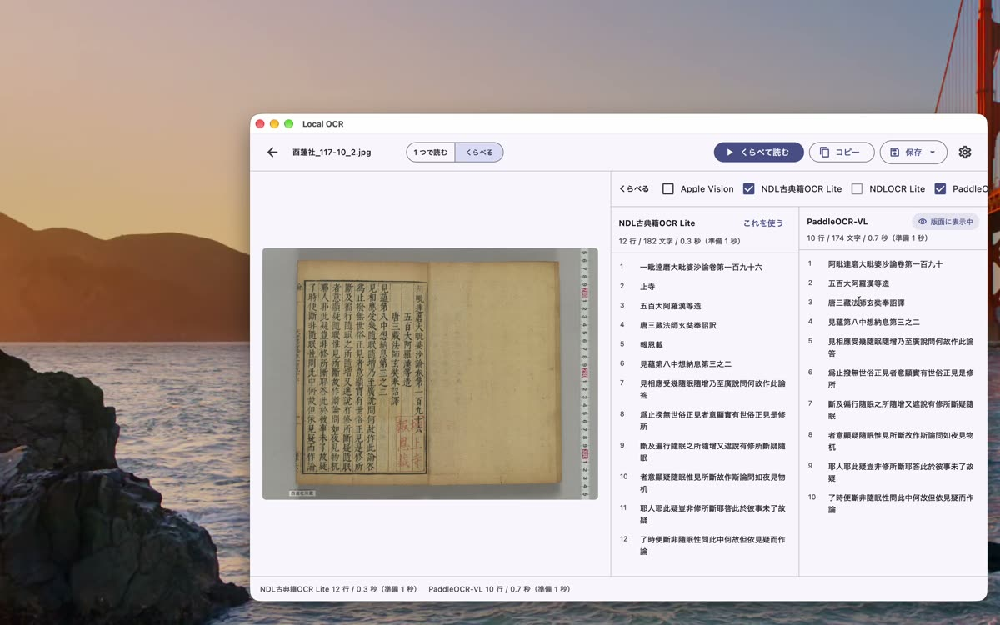

<iframe src="https://www.youtube-nocookie.com/embed/X0H37OL3quI" title="いろいろな使い方" style="position:absolute;top:0;left:0;width:100%;height:100%;border:0" allow="encrypted-media; picture-in-picture" allowfullscreen></iframe>

## フォルダをまとめて読む

ページごとの画像を 1 つのフォルダにまとめてあれば、最初の画面の「フォルダ」で開けます。
フォルダの中の画像が、ページの束として開きます（中のフォルダまでは見ません）。
下の矢印でページを移れます。「すべて読む」で全部のページを順に読み、「中止」で止められます。

束を開いているときは、保存の一覧に「すべてのページ」が加わります。TEI/XML なら、全ページが 1 つのファイルになります。

## IIIF マニフェストから開く

デジタルアーカイブの画像は、IIIF マニフェストの URL から直接開けます。
URL をコピーしてから「IIIF マニフェスト」を押すと、コピーした URL がはじめから入っています。「開く」を押します。
画像は、見るページの分だけその都度取り寄せます。読むのは、このパソコンの中だけです。

## コピーした画像を貼り付ける

ほかのソフトでコピーした画像は、「貼り付け」（または ⌘V、Windows は Ctrl+V）でそのまま読めます。
画面の一部を切り取ってコピーすれば、その部分だけを読めます。

## ほかの読む道具を取得する

右上の歯車で「設定」を開くと、読む道具の一覧が出ます。使うものだけ「取得」すれば足ります。使わなくなったら「削除」で消せます。

| 読む道具 | 向いている資料 | 取得 |
| --- | --- | --- |
| Apple Vision（Mac のみ） | 現代の活字・手書き | 不要 |
| NDL古典籍OCR Lite | 古典籍・くずし字 | 83MB |
| NDLOCR Lite | 近代資料の活字・手書き | 157MB |
| PaddleOCR-VL | 漢籍・多言語、縦書き | 1.8GB |
| Yigdzin-1 | チベット語 | 1.7GB |

設定では、画面の明るさ（システムに合わせる・明るい・暗い）と、画面の言葉（日本語・English）も選べます。

## くらべる

どの道具が合うか迷ったら、上の「くらべる」を押します。チェックを入れた道具で同じ画像を読み、結果を並べて見られます。
行の数・文字の数・かかった時間もくらべられます。「これを使う」を押すと、その結果が画像に重なります（行の位置を返す道具なら、画像の上に枠が出ます）。

