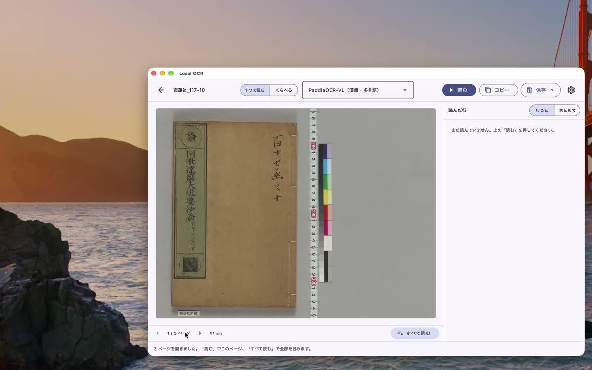
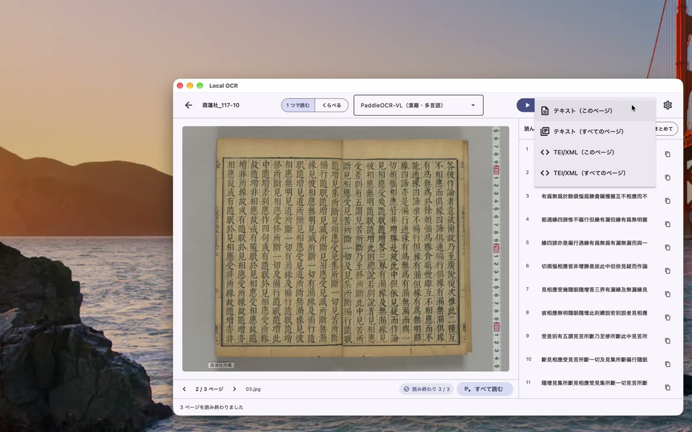
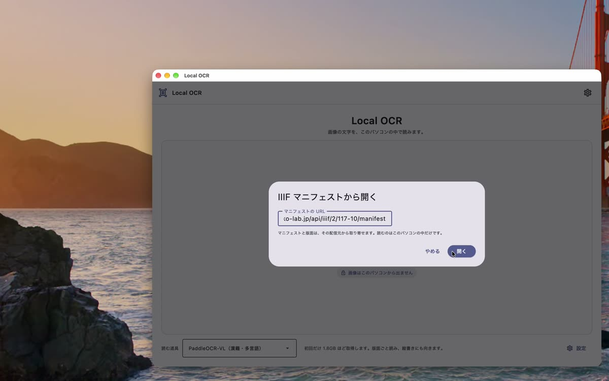
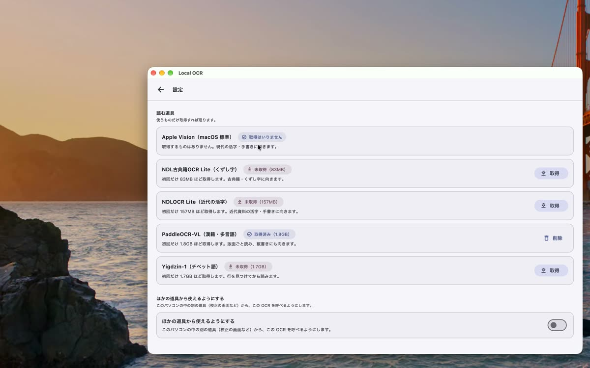
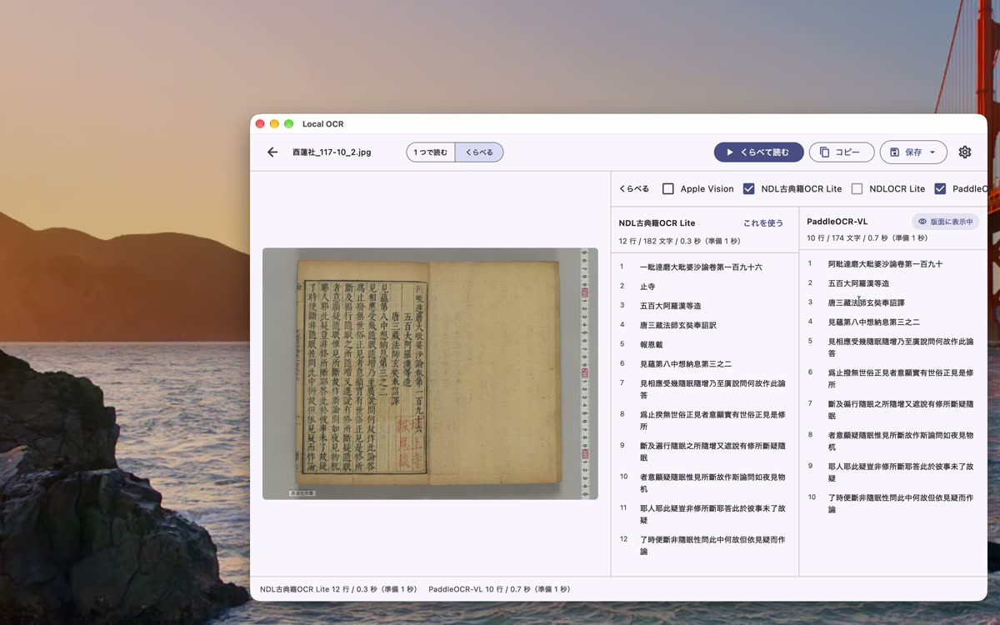

<div style="position:relative;padding-bottom:62.5%;height:0;overflow:hidden;margin:1em 0"><iframe src="https://www.youtube-nocookie.com/embed/SSWMVJbkjf8" title="いろいろな使い方" style="position:absolute;top:0;left:0;width:100%;height:100%;border:0" allow="encrypted-media; picture-in-picture" allowfullscreen></iframe></div>

## フォルダをまとめて読む

ページごとの画像を 1 つのフォルダにまとめてあれば、最初の画面の「フォルダ」で開けます。
フォルダの中の画像が、ページの束として開きます（中のフォルダまでは見ません）。
下の矢印でページを移れます。「すべて読む」で全部のページを順に読み、「中止」で止められます。



束を開いているときは、保存の一覧に「すべてのページ」が加わります。TEI/XML なら、全ページが 1 つのファイルになります。



## IIIF マニフェストから開く

デジタルアーカイブの画像は、IIIF マニフェストの URL から直接開けます。
URL をコピーしてから「IIIF マニフェスト」を押すと、コピーした URL がはじめから入っています。「開く」を押します。
画像は、見るページの分だけその都度取り寄せます。読むのは、このパソコンの中だけです。



## コピーした画像を貼り付ける

ほかのソフトでコピーした画像は、「貼り付け」（または ⌘V、Windows は Ctrl+V）でそのまま読めます。
画面の一部を切り取ってコピーすれば、その部分だけを読めます。

## ほかの読む道具を取得する

右上の歯車で「設定」を開くと、読む道具の一覧が出ます。使うものだけ「取得」すれば足ります。使わなくなったら「削除」で消せます。

| 読む道具 | 読める言語 | 向いている資料 | 取得 |
| --- | --- | --- | --- |
| Apple Vision（Mac のみ） | 日本語・英語・中国語 | 現代の活字・手書き | 不要 |
| NDL古典籍OCR Lite | 日本語（漢文を含む） | 古典籍・くずし字 | 83MB |
| NDLOCR Lite | 日本語 | 近代資料の活字・手書き | 157MB |
| PaddleOCR-VL | 中国語・日本語・英語ほか多数 | 漢籍・多言語、縦書き | 1.8GB |
| Yigdzin-1 | チベット語 | チベット語の資料 | 1.7GB |



設定では、画面の明るさ（システムに合わせる・明るい・暗い）と、画面の言葉（日本語・English）も選べます。

## くらべる

どの道具が合うか迷ったら、上の「くらべる」を押します。チェックを入れた道具で同じ画像を読み、結果を並べて見られます。
行の数・文字の数・かかった時間もくらべられます。「これを使う」を押すと、その結果が画像に重なります（行の位置を返す道具なら、画像の上に枠が出ます）。



## スクリプトから使う {#script}

画像が何百枚もあるときは、画面で 1 枚ずつ読むより、スクリプトに任せるほうが楽です。
Local OCR を開いたまま、「設定」の「ほかの道具から使えるようにする」をオンにすると、同じパソコンの中のスクリプトから読む道具を呼べます。
Python の仮想環境やモデルの準備は要りません。アプリが取得した道具を、そのまま使います。

次の例は、フォルダの中の画像を 1 枚ずつ読み、同じ名前の `.txt` に書き出します。
Python に最初から入っている部品だけで動きます。

```python
# read_folder.py — 使い方: python3 read_folder.py 画像のフォルダ [読む道具]
import base64, json, sys, urllib.request
from pathlib import Path

URL = "http://127.0.0.1:8080/v1/ocr"
folder = Path(sys.argv[1])
engine = sys.argv[2] if len(sys.argv) > 2 else "paddle-vl"

for image in sorted(folder.iterdir()):
    if image.suffix.lower() not in (".jpg", ".jpeg", ".png", ".tif", ".tiff"):
        continue
    body = json.dumps({
        "engine": engine,
        "image": base64.b64encode(image.read_bytes()).decode(),
    }).encode()
    req = urllib.request.Request(URL, data=body, headers={"Content-Type": "application/json"})
    with urllib.request.urlopen(req, timeout=600) as res:
        result = json.load(res)
    image.with_suffix(".txt").write_text(result["text"], encoding="utf-8")
    print(image.name, len(result["lines"]), "行")
```

読む道具の名前は次のとおりです（取得済みのものだけ使えます）。

| 名前 | 読む道具 |
| --- | --- |
| `paddle-vl` | PaddleOCR-VL |
| `ndl-koten-lite` | NDL古典籍OCR Lite |
| `ndl-lite` | NDLOCR Lite |
| `yigdzin` | Yigdzin-1 |
| `apple-vision` | Apple Vision（Mac のみ） |

返ってくる結果には、本文（`text`）のほかに、行ごとの文字と位置（`lines`）が入っています。
画像の一部だけを読むときは `"region": {"x": 0, "y": 0, "w": 800, "h": 600}` を、PaddleOCR-VL で行の位置も取るときは `"mode": "lines"` を足します。
いま使える道具と読み方の一覧は、ブラウザで `http://127.0.0.1:8080/v1/engines` を開くと見られます。

アプリを開かずに、コマンドとして使う方法もあります（ソースから入れる必要があります）。手順は [GitHub の説明](https://github.com/nakamura196/local-ocr#開発)にあります。
