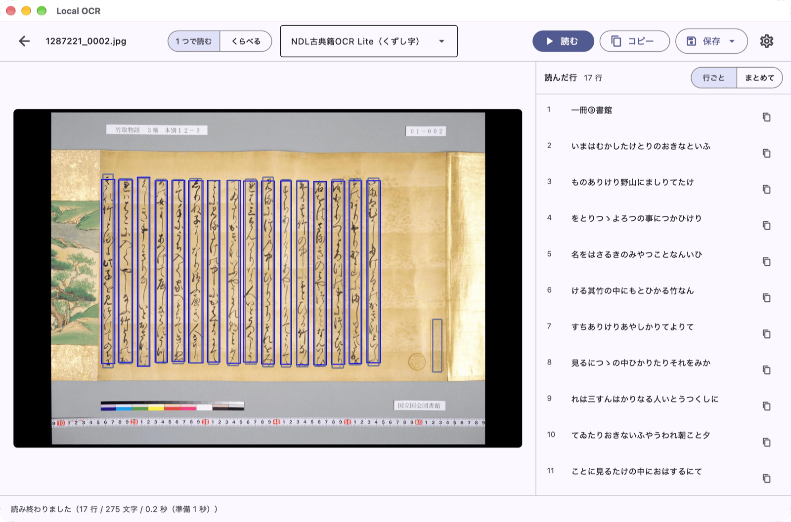

画像を入れると、文字が出てきます。
文字の認識は、すべて手元のパソコンの中で行います。画像はどこへも送りません。

日本語（現代の活字から古典籍のくずし字まで）、中国語（漢文・現代文）、英語、チベット語を読めます。
資料に合わせて、読む道具（認識エンジン）を選べます。

### ダウンロード
{: #download }

| | |
| --- | --- |
| Windows | [Microsoft ストア](https://apps.microsoft.com/detail/9N07ZD1ZPKBZ)（無料。ストアが署名するので警告は出ません） |
| macOS | [Releases](https://github.com/nakamura196/local-ocr/releases/latest)（署名・公証済みの `.dmg`） |

導入作業は要りません。PaddleOCR-VL のモデルを動かす `llama-server` はアプリに同梱しています。
読む道具（認識モデル）は、初めて使うときに取得します。

### 動画で見る

インストール、基本の使い方、いろいろな使い方、校正の画面（TEI/IIIF エディタ）で使う、の 4 本が続けて流れます。声と字幕で説明しています。

<iframe src="https://www.youtube-nocookie.com/embed/DUlKilClRgM?playlist=DUlKilClRgM,qaLAR2l7FPI,SSWMVJbkjf8,O56_yGbKBVI&rel=0" title="Local OCR の使い方" style="width:100%;aspect-ratio:16/10;border:0" allow="encrypted-media; picture-in-picture; fullscreen" allowfullscreen loading="lazy"></iframe>

*同じ内容を、写真つきの手順でも読めます: [使い方](guide.md)*

### できること

- **入力**: 画像ファイル、クリップボード、ページ画像を集めたフォルダ、[IIIF](https://iiif.io/) マニフェストの URL
- **出力**: プレーンテキスト（`.txt`）または TEI/XML（`.xml`）
- **比較**: 同じページを 2 つの読む道具で読ませて、結果を並べて確かめる
- 日本語・英語の画面、ライト・ダーク両対応

### リンク

- [使い方](guide.md) — 動画と、写真つきの手順
- [ソースコード](https://github.com/nakamura196/local-ocr)（MIT）
- [プライバシーポリシー](privacy-policy.md)

### 開発

中村 覚（東京大学）
連絡先: nakamura@hi.u-tokyo.ac.jp
